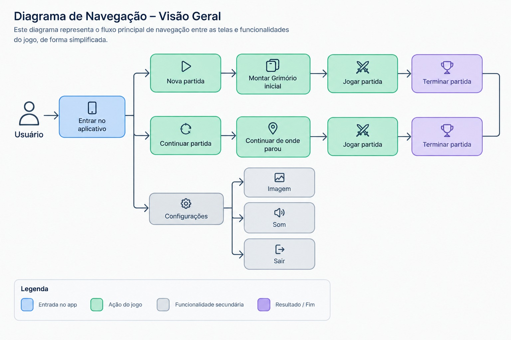
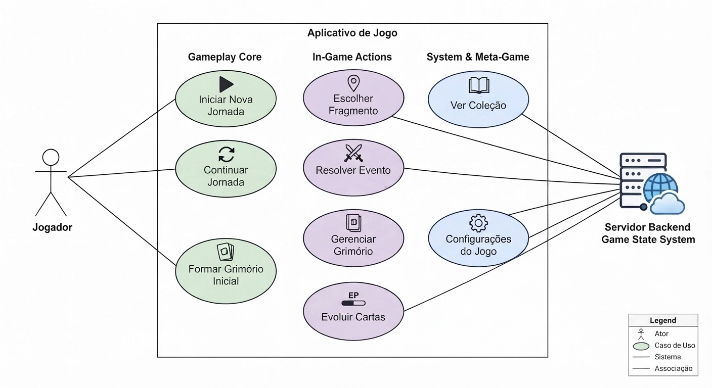

# Documentação do Projeto: Jogo Mobile de Cartas (Rogue-like & Lovecraft)

Este repositório contém a documentação estruturada e o planejamento de um jogo mobile de cartas no estilo *rogue-like*, projetado com uma interface vertical e inspirado em obras de horror cósmico (Lovecraft) e cultura clássica.

---

## 📑 Sumário
1. [Entendimento do Problema e Contexto](#1-entendimento-do-problema-e-contexto)
2. [Entendimento do Usuário e Requisitos](#2-entendimento-do-usuário-e-requisitos)
3. [Projetando Soluções](#3-projetando-soluções)

---

## 1. Entendimento do Problema e Contexto

### 1.1 - Quem é o usuário?
* **Usuários principais:** Jogadores de smartphones interessados em jogos de estratégia baseados em cartas, especialmente entusiastas de *card games*, *deck-builders* e *roguelikes*.

### 1.2 - Qual problema seu projeto resolve?
Muitos jogos utilizam individualmente elementos como card games, roguelikes, deck-building ou narrativa. Este projeto investiga a **combinação desses elementos** em uma experiência criada prioritariamente para smartphones, com o aparelho utilizado na **vertical**.

O sistema integra:
* Combate estratégico baseado em cartas;
* Construção e evolução do Grimório (deck);
* Progressão baseada em Jornadas, Atos e Fragmentos;
* Decisões dinâmicas que modificam a progressão da partida;
* Elementos de *roguelike/deckbuilder*;
* Narrativa e ambientação de horror cósmico;
* Interação adaptada ao formato mobile vertical.

### 1.3 - Quem são os interessados (Stakeholders)?
* **Principais:**
  * Jogadores e usuários finais;
  * Desenvolvedor responsável pelo projeto;
  * Professor orientador;
  * Instituição de ensino / banca avaliadora.
* **Secundários / Potenciais:**
  * Plataformas de distribuição mobile (Google Play e App Store);
  * Testadores do protótipo;
  * Serviços externos utilizados pelo jogo (se aplicável futuramente).

### 1.4 - Por que seu projeto gera valor?
* Oferece uma experiência de entretenimento estratégico portátil e fluida;
* Une progressão *roguelike*, gestão de Grimório e narrativa coesa;
* Garante alta rejogabilidade por meio de diferentes Jornadas, escolhas de Fragmentos e composições de deck;
* Atua como aplicação prática de engenharia de software, arquitetura de sistemas, design de interfaces, persistência de dados e desenvolvimento de jogos.

---

## 2. Entendimento do Usuário e Requisitos

> **Disclaimer:** 
> A persona foi inicialmente elaborada com base no público-alvo definido para o projeto e poderá ser refinada posteriormente por meio de validação com usuários. 

### 2.1 - Criação da Persona
* **Nome fictício:** Lucas Almeida
* **Idade:** 14 anos
* **Ocupação:** Estudante
* **Plataforma principal:** Smartphone
* **Experiência com jogos:** Casual a intermediária
* **Perfil e Hábitos:** Utiliza o celular diariamente em sessões curtas (10 a 20 minutos). Prefere jogos que introduzem mecânicas de forma gradual e permitem aprender jogando.
* **Objetivos:** Entretenimento e desafios estratégicos acessíveis, com interesse em histórias misteriosas descobertas organicamente pelo gameplay (sem textos longos interrompendo a ação).
* **Frustrações:** Excesso de regras iniciais, partidas longas demais, textos excessivos ou sensação de derrota exclusiva por sorte.
* **Necessidades:** Interface legível na vertical, introdução gradual de mecânicas, partidas de até 20 minutos e curva de dificuldade equilibrada.

### 2.2 - Jornada do Usuário (Fluxo Principal)
1. **Acesso ao jogo:** Inicialização na tela principal pelo smartphone.
2. **Seleção de Jornada:** Escolha da temática, narrativa, cartas e Ser Ancestral.
3. **Formação do Grimório Inicial:** Recebimento de 15 cartas (10 fixas + 5 escolhidas pelo jogador a partir do Códice).
4. **Entrada no Ato I:** Apresentação das opções de progresso (Fragmentos).
5. **Escolha de um Fragmento:** Definição do próximo evento (*Confronto*, *Fortúnio* ou *Presságio*).
6. **Resolução do Evento:** Combate tático ou obtenção de recompensas/melhorias.
7. **Gerenciamento do Grimório:** Obtenção e evolução de cartas para o Códice.
8. **Progressão entre Atos:** Avanço pelos 5 Atos com dificuldade progressiva.
9. **Confronto com o Ser Ancestral:** Batalha final do último Ato.
10. **Encerramento:** Conclusão da Jornada (Vitória, Derrota ou Rendição) com salvamento de progressão no Códice.

> **Fluxo Resumido:**  
> Acesso ao jogo $\rightarrow$ Seleção da Jornada $\rightarrow$ Formação do Grimório $\rightarrow$ Ato $\rightarrow$ Escolha de Fragmento $\rightarrow$ Resolução do Evento $\rightarrow$ Progressão $\rightarrow$ Próximo Ato $\rightarrow$ Ser Ancestral $\rightarrow$ Conclusão / Game Over



### 2.3 - Requisitos do Sistema

#### 2.3.1 — Requisitos Funcionais (RF)
* **RF01:** Iniciar uma nova Jornada.
* **RF02:** Montar o Grimório inicial da Jornada.
* **RF03:** Continuar uma Jornada previamente interrompida.
* **RF04:** Salvar o progresso da Jornada.
* **RF05:** Exibir e permitir a escolha de Fragmentos.
* **RF06:** Resolver eventos da Jornada.
* **RF07:** Executar confrontos utilizando as regras de combate do jogo.
* **RF08:** Controlar atributos, estados e efeitos das cartas durante os confrontos.
* **RF09:** Gerenciar o Grimório e o Códice.
* **RF10:** Registrar a evolução persistente das cartas.
* **RF11:** Gerenciar a progressão da Jornada entre Atos e Fragmentos.
* **RF12:** Identificar e processar condições de vitória, derrota, empate e rendição.
* **RF13:** Permitir o acesso às configurações do aplicativo.

#### 2.3.2 — Requisitos Não Funcionais (RNF)
* **RNF01:** O jogo deve funcionar offline em suas funcionalidades principais.
* **RNF02:** O sistema deve ser desenvolvido para smartphones com **orientação vertical**.
* **RNF03:** Desempenho otimizado para dispositivos móveis de entrada e intermediários compatíveis.
* **RNF04:** Duração planejada de cada Jornada em **aproximadamente 20 minutos ou menos**.
* **RNF05:** Interface com legibilidade garantida em telas verticais de smartphones.
* **RNF06:** Feedback visual e/ou sonoro claro para ações e consequências.
* **RNF07:** Introdução progressiva das principais mecânicas (*onboarding* natural).
* **RNF08:** Armazenamento consistente para salvamento de partidas e progressão persistente.
* **RNF09:** Aplicação consistente das regras de combate e efeitos das cartas.
* **RNF10:** Tempo de resposta adequado para interações em dispositivos móveis.

### 2.4 - Modelagem de Casos de Uso
* **Ator Principal:** Jogador.
* **Casos de Uso Principais:**
  * `UC01 - Iniciar/Continuar Jornada` (Vinculado a RF01, RF03, RF04)
  * `UC02 - Montar Grimório` (Vinculado a RF02, RF09)
  * `UC03 - Selecionar Fragmento` (Vinculado a RF05, RF11)
  * `UC04 - Realizar Combate / Confronto` (Vinculado a RF06, RF07, RF08)
  * `UC05 - Evoluir Cartas no Códice` (Vinculado a RF09, RF10)



---

## 3. Projetando Soluções

### 3.1 - Projeto Arquitetural

#### 3.1.1 - Definição da Arquitetura
O projeto adota uma arquitetura em camadas estruturada em componentes independentes para desacoplar a lógica de jogo, interface e persistência, garantindo eficiência em dispositivos móveis:
1. **Camada de Apresentação (UI/UX):** Responsável por renderizar as telas verticais, gerenciar animações de toque e interações táteis (Godot Engine / Unity). Utiliza componentes adaptáveis para diferentes resoluções de smartphones.
2. **Camada de Lógica de Jogo / Domínio:** Concentra as regras de negócio, incluindo a máquina de estados do combate, gestão de turnos, cálculo de efeitos das cartas, árvore de progressão de Atos/Fragmentos e controle do Grimório.
3. **Camada de Persistência de Dados:** Responsável por serializar o estado da Jornada em andamento e salvar a coleção global do jogador (*Códice* e evolução de cartas) utilizando armazenamento local seguro (ex: SQLite ou JSON estrito).

#### 3.1.2 - Diagrama Arquitetural de Camadas (Visão Textual)
```text
[ Camada de Apresentação (UI Mobile Vertical) ]
                      ↓ (Controladores de Eventos)
[ Camada de Domínio / Lógica de Jogo ]
   ├── Gerenciador de Jornada (Atos & Fragmentos)
   ├── Motor de Combate por Turnos
   └── Gerenciador de Grimório e Códice
                      ↓ (Interfaces de Repositório)
[ Camada de Persistência (Armazenamento Local) ]
```

---

### 3.2 - Diagrama de Classes (Estrutura Básica)

A modelagem orientada a objetos orienta-se em torno das seguintes classes e estruturas essenciais:

* **`Jogador`**
  * Atributos: `id`, `codiceGlobal` (Lista de `Carta`).
  * Métodos: `iniciarJornada()`, `salvarProgresso()`.

* **`Jornada`**
  * Atributos: `idJornada`, `tematica`, `atoAtual` (1 a 5), `serAncestral`.
  * Métodos: `avancarAto()`, `verificarCondicaoFim()`.

* **`Grimorio`**
  * Atributos: `cartasAtivas` (Lista de `Carta`), `limiteMaximo`.
  * Métodos: `adicionarCarta()`, `removerCarta()`, `embaralhar()`.

* **`Carta`**
  * Atributos: `idCarta`, `nome`, `custo`, `efeito`, `nivelEvolucao`.
  * Métodos: `aplicarEfeito()`, `evoluir()`.

* **`Combate`**
  * Atributos: `turno`, `vidaJogador`, `vidaInimigo`, `maoAtual`.
  * Métodos: `comprarCarta()`, `jogarCarta()`, `encerrarTurno()`.

* **`Fragmento`**
  * Atributos: `tipo` (Confronto, Fortúnio, Presságio), `recompensa`.
  * Métodos: `resolverEvento()`.

---
### 3.3 - Fluxograma e Diagramas de Atividades


